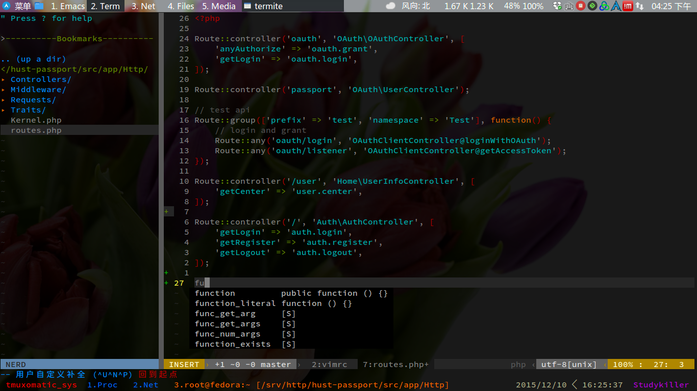
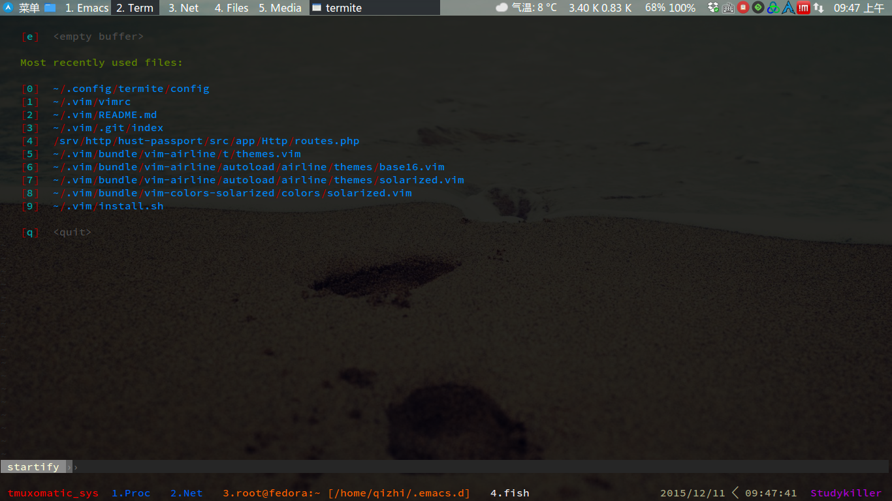

## My Vim Configs!
This is my personal vim configs git repo.

## Installation

    git clone https://github.com/qizhihere/vim ~/.vim
    sh ~/.vim/install.sh

## Screenshots
Overview:

Auto complete:

Startify:

Markdown:

